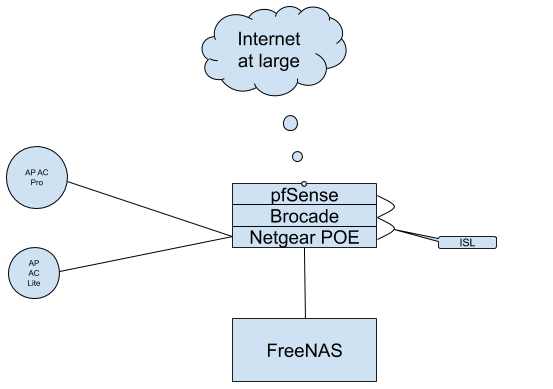

## Sweet, Sweet Overkill

There are lots of things I could say about my home network, I'll probably say a lot of them in this post, but mostly I want to say that it is sweet, glorious overkill.

My network serves a couple of desktop computers, a few laptops, a handful of phones & tablets, smattering of IoT devices, a sprinkling of single board computers, & a modest 3 node Kubernetes (K8s) cluster [A short digression, Kubernetes is often shortened to K8s, 8 representing the 8 letters in between the K and s in Kubernetes. Digression done. See I told you it would be short]. Connecting it all together and to the larger internet I have a 26U rack. In the rack I have a pfSense firewall, a 48 port gigabit Brocade switch, an 8 port multi-gig Netgear switch, and for storage, a lovely 24-bay SuperMicro server running FreeNAS. Most of my infrastructure I acquired 2nd hand, but it still runs great and is fun to tinker with (The HDDs in my FreeNAS box were all new when I purchased them).

A diagram of my physcial network looks something like this:

_All the devices not pictured either connect wirelessly through the APs or are wired to the Brocade switch._

Now for some detailed specs:

+ Firewall
  + pfSense
  + Intel® Atom™ D2500 CPU dual core @1.86GHz
  + Intel® D2500CC Motherboard
  + 4GB DDR3
  + 2xIntel® 82574L Gigabit Ethernet
+ Switch1
  + Brocade ICX6610-48 48 port gigabit switch
+ Switch2
  + Netgear MS510TXPP 8 port multigig smart managed pro with POE+ (this powers the APs)
+ AP1
  + Ubiquti UniFi AP-AC Pro
+ AP2
  + Ubiquti UniFi AP-AC Lite
+ Storage
  + FreeNAS
  + SuperMicro SC846TQ-R900B Chassis
  + SuperMicro MBD-H8DME-2-O
  + 2xQuad-Core AMD Opteron™ Processor 2372 HE @2.1GHz
  + 32 GB RAM ECC DDR2
  + Intel® EXPI9404PTL NIC in a 4GB LAG to the Brocade Switch
  + On board NICs connected to the Brocade Switch as well, but not in the LAG
  + IPMI Card
  + 4x Seagate Ironwolf 6TB in RAID10
  + 4x HGST Deskstar NAS 4TB also in RAID10
